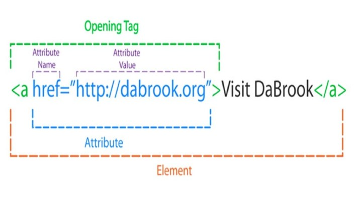

import { Head, Notes } from "mdx-deck";
import { CodeSurfer } from "mdx-deck-code-surfer";
import Highlighter from "react-syntax-highlighter";
import nightOwl from "prism-react-renderer/themes/nightOwl";

import myTheme from "./theme";
export const theme = myTheme;

<Head>
	<title>HTML | 01 | Introduction</title>
</Head>

import codeExample1 from "!!raw-loader!./code/a/01-a.html";
import codeExample2 from "!!raw-loader!./code/a/02-a.html";
import codeExample3 from "!!raw-loader!./code/a/03-a.html";

## HTML Introduction

---

### HTML

HTML (HyperText Markup Language) is the most basic building block of the Web.

> Further Reading: https://developer.mozilla.org/en-US/docs/Web/HTML

---

### HTML

It defines the structure of any webpage you visit, and defines the content of a page.

> Further Reading: https://developer.mozilla.org/en-US/docs/Web/HTML

---



> Source: https://incomejoin.com/2019/05/13/html-attributes-html-5-tutorial/

---

### Building A Link

The HTML `<a>` element (or anchor element), creates a hyperlink to web pages.

> Further Reading: https://developer.mozilla.org/en-US/docs/Web/HTML/Element/header

---

<CodeSurfer
	theme={nightOwl}
	title="Our Code"
	code={codeExample1}
	lang="html"
	steps={[
		{
			lines: [1],
			notes:
				"We start our element with an HTML opening tag which is made up of 3 parts"
		},
		{
			lines: [1],
			notes: "First we have a left-angle bracket (<)"
		},
		{
			lines: [1],
			notes: "Next the name of our element (a)"
		},
		{
			lines: [1],
			notes: "Last we have a right-angle bracket (>)"
		},
		{
			lines: [2],
			notes: "We then close our element with an HTML closing tag"
		},
		{
			lines: [2],
			notes:
				"This follows the same structure as the opening tag, but with a forward slash before the element name (a)"
		},
		{
			notes: ""
		}
	]}
/>

---

### Anchor text

Text within each `<a>` should describe the link's destination.

> Further Reading: https://developer.mozilla.org/en-US/docs/Web/HTML/Element/a

---

<CodeSurfer
	theme={nightOwl}
	title="Our Code"
	code={codeExample2}
	lang="html"
	steps={[
		{
			lines: [1],
			notes:
				"For example, an anchor that we want to navigate to the page titled 'About' may include the title in its text content"
		},
		{
			lines: [1],
			notes:
				"This content is important, even when visually hidden as it is read aloud to screen readers and creates accessible pages"
		}
	]}
/>

---

## HTML Attributes

HTML elements can contain attributes related to the actions of the element.

---

## Anchor 'href' Attribute

`<a href="test.com">`

The URL that the hyperlink points to.

> Further Reading: https://developer.mozilla.org/en-US/docs/Web/HTML/Element/a#attr-href

---

<CodeSurfer
	theme={nightOwl}
	title="Our Code"
	code={codeExample3}
	lang="html"
	steps={[
		{
			lines: [1],
			notes:
				"We can add a 'href' attribute to the anchor elment with the value '/about'."
		},
		{
			lines: [1],
			notes:
				"The value '/about' is assigned to the 'href' attribute. This tells the browser to direct a user to the current website + about (e.g. test.com/about)."
		}
	]}
/>

---

## What We have

<iframe
	src="https://codesandbox.io/embed/admiring-snow-7swl2?fontsize=14&hidenavigation=1&theme=dark"
	style={{
		width: "100%",
		height: "300px",
		border: 0,
		borderRadius: "4px",
		overflow: "hidden"
	}}
	title="HTML 01 - Introduction"
	allow="geolocation; microphone; camera; midi; vr; accelerometer; gyroscope; payment; ambient-light-sensor; encrypted-media; usb"
	sandbox="allow-modals allow-forms allow-popups allow-scripts allow-same-origin"
/>

> View in full at: https://7swl2.csb.app/
>
> View source code at: https://codesandbox.io/s/admiring-snow-7swl2?fontsize=14&hidenavigation=1&theme=dark

```

```
