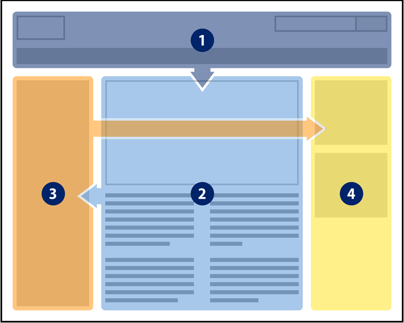

import { Head, Notes } from "mdx-deck";
import Highlighter from "react-syntax-highlighter";

import myTheme from "./theme";
export const theme = myTheme;

import { CodeSurfer } from "mdx-deck-code-surfer";
import nightOwl from "prism-react-renderer/themes/nightOwl";

<Head>
	<title>01 | HTML Introduction</title>
</Head>

import codeHeader1 from "!!raw-loader!./code/header/01-header.html";
import codeHeader2 from "!!raw-loader!./code/header/02-header.html";
import codeHeader3 from "!!raw-loader!./code/header/03-header.html";
import codeHeader4 from "!!raw-loader!./code/header/04-header.html";

## HTML Introduction

---

### HTML

HTML (HyperText Markup Language) is the most basic building block of the Web.

It defines the structure of any webpage you visit, and defines the content of a page.

> Further Reading: https://developer.mozilla.org/en-US/docs/Web/HTML

---

### HTML

If front-end development was compared to building a house...

HTML acts as the bricks and materials used to layout the foundations of a building.

> Further Reading: https://developer.mozilla.org/en-US/docs/Web/HTML

---

> Source: https://www.kissclipart.com/web-page-ux-layout-clipart-page-layout-web-page-us-k6rge5/download-clipart.html

---

### Building Our First Component

To get started with HTML, we are going to focus entirely on an isolated component.

The first component we will build is the header component.

---

### Header

Header components are found on almost every website and are a pattern most are familiar with.

Often, a header contains a logo, a navigation menu, some links, and various other elements.

---

### Header

To create the header, we are going to create an HTML element.

The HTML `<header>` element represents the parent element used to group together our header children elements.

> Further Reading: https://developer.mozilla.org/en-US/docs/Web/HTML/Element/header

---

<CodeSurfer
	theme={nightOwl}
	title="Our Code"
	code={codeHeader1}
	lang="html"
	steps={[
		{
			lines: [1],
			notes:
				"We start our element with an HTML opening tag which is made up of 3 parts"
		},
		{
			lines: [1],
			notes: "First we have a left-angle bracket (<)"
		},
		{
			lines: [1],
			notes: "Next the name of our element (header)"
		},
		{
			lines: [1],
			notes: "Last we have a right-angle bracket (>)"
		},
		{
			lines: [2],
			notes: "We then close our element with an HTML closing tag"
		},
		{
			lines: [2],
			notes:
				"This follows the same structure as the opening tag, but with a forward slash before the element name (header)"
		},
		{
			notes: ""
		}
	]}
/>

---

### Navigation (nav)

Next we will build our navigation menu.

Building this element will be similar to our header element, with the name of our element now being `<nav>`.

> Further Reading: https://developer.mozilla.org/en-US/docs/Web/HTML/Element/nav

---

<CodeSurfer
	theme={nightOwl}
	title="Our Code"
	code={codeHeader2}
	lang="html"
	steps={[
		{
			lines: [1, 3],
			notes:
				"Before we create our navigation, we will want to create a new line in-between our 'header' opening and closing element tags."
		},
		{
			lines: [2],
			notes:
				"We can then insert our new 'nav' (navigation) element as a child of our 'header' parent element. With appropriate opening and closing tags."
		}
	]}
/>

---

### So Far So Good

So far we have two HTML elements.

The only issue is that we have only worked on structural elements and our page doesn't visually display anything to a user.

---

### Anchor

The HTML `<a>` element (or anchor element), with its href attribute, creates a hyperlink to web pages, files, email addresses, locations in the same page, or anything else a URL can address.

Content within each `<a>` should indicate the link's destination.

> Further Reading: https://developer.mozilla.org/en-US/docs/Web/HTML/Element/a

---

<CodeSurfer
	theme={nightOwl}
	title="Creating our header"
	code={codeHeader3}
	lang="html"
	steps={[
		{
			range: [2, 6],
			notes: "Anchor elements will exist as children of our navigation element"
		},
		{
			lines: [3],
			notes:
				"Each anchor (a) consists of an opening tag, text content, and then a closing tag"
		},
		{
			range: [3, 5],
			notes:
				"Each anchor (a) consists of an opening tag, text content, and then a closing tag"
		},
		{
			notes:
				"When viewed from a top level, this is what our header looks like now"
		}
	]}
/>

---

## HTML Attributes

HTML opening elements can contain attributes related to the actions or way in which an element is rendered to a page.

These attributes are captured after the element name (e.g. nav) and before the right-angle bracket (>).

---

## Anchor 'href' Attribute

`<a href="https://google.com">`

The URL that the hyperlink points to.

> Further Reading: https://developer.mozilla.org/en-US/docs/Web/HTML/Element/a#attr-href

---

<CodeSurfer
	theme={nightOwl}
	title="Creating our header"
	code={codeHeader4}
	lang="html"
	steps={[
		{
			lines: [3],
			notes:
				"We can add a 'href' attribute to the home anchor elment with the value '/'."
		},
		{
			lines: [3],
			notes:
				"The value '/' tells the anchor to use the name of the current website e.g. (test.com) as the link to direct a user to when clicked on."
		},
		{
			lines: [4],
			notes:
				"When repeating the process with the about anchor element, we use the value '/about'. This tells the browser to direct a user to the current website + about (e.g. test.com/about)."
		},
		{
			range: [3, 5],
			notes:
				"When complete for all anchor tags, we've created a functional navigation system, accessible to all those using our website."
		},
		{
			range: [1, 7],
			notes: ""
		}
	]}
/>

---

## What We have

<iframe
	src="https://codesandbox.io/embed/admiring-snow-7swl2?fontsize=14&hidenavigation=1&theme=dark"
	style={{
		width: "100%",
		height: "300px",
		border: 0,
		borderRadius: "4px",
		overflow: "hidden"
	}}
	title="HTML 01 - Introduction"
	allow="geolocation; microphone; camera; midi; vr; accelerometer; gyroscope; payment; ambient-light-sensor; encrypted-media; usb"
	sandbox="allow-modals allow-forms allow-popups allow-scripts allow-same-origin"
/>

> View in full at: https://7swl2.csb.app/
>
> View source code at: https://codesandbox.io/s/admiring-snow-7swl2?fontsize=14&hidenavigation=1&theme=dark
